# ResDEEDS User Manual
## Overview
The user interacts with the ResDEEDS application via a web interface built using the Flask web framework for Python and the Jinja templating engine. The web interface supports Okta authentication for centralized deployments; however, we currently recommend that ResDEEDS be run locally using Flask’s built-in web server, as described in the top-level README. The web interface workflow consists of seven pages, each of which supports one or more steps of the planning stage of the INL Resilience Framework. The pages form an iterative workflow that allows a user to input their baseline system information, hazard definitions, and modeling parameters. The user then prioritizes hazards and defines goals for various resilience metrics for each hazard. The web interface then calls the Spine Toolbox to evaluate the system on these metrics. The user is given results for the metrics through the web interface, at which point the user can iterate on the system until it meets the resilience goals. Once the user is satisfied with the system, they can view a page that summarizes the differences between the initial baseline system and the final system that was evaluated.

## Using ResDEEDS
### Project Selection
ResDEEDS is based around *projects*. We define a project as a system being evaluated, and the hazards and goals associated with that evaluation. After logging in (if authentication is enabled), the user is presented with a list of their projects. The user can choose to continue or delete a previous projects, or create a new project.

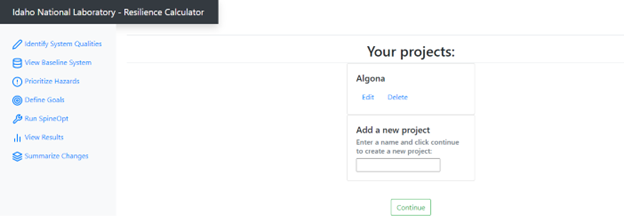

ResDEEDS uses the Spine framework to simulate systems. When a new project is created, the template Spine Toolbox project is copied from `ResDEEDS/spine/Spine` to a new project-specific directory under `ResDEEDS/spine/projects`. This is where all information associated with that project is stored.

### Identify System Qualities
After creating a new project, users are presented with the Identify System Qualities page. On this page, the user can upload the spreadsheet that defines their system. This system is imported into Spine and saved as the *baseline system*. The baseline system acts as the point of comparison when later determining what modifications need to be made to a system in order to meet resilience goals. The baseline system remains constant unless the user returns to this page and uploads a new spreadsheet, which effectively restarts the project.

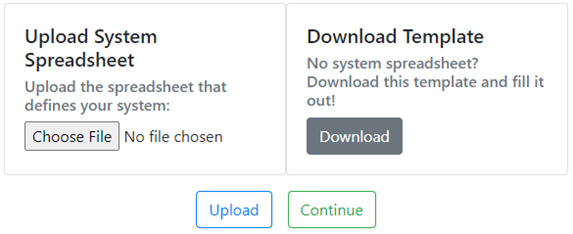

The spreadsheet uploaded on this page also contains definitions of hazards and modeling parameters that are passed to Spine. These parameters, as well as the system format, are defined in a template spreadsheet, which is available for download on this page.

When the spreadsheet is uploaded, the entire Spine Toolbox workflow is run for the baseline system, and the results are saved as the baseline metric values. These values allow the user to see how proposed changes to their system are affecting their resilience metrics.

### View Baseline System
After uploading a spreadsheet, the user clicks Continue to navigate to the View Baseline System page. This page shows the data from the spreadsheet, as imported into and read back out of Spine. This page is read-only and allows the user to confirm that their system was imported correctly. Additionally, the user can always navigate back to this page to see what their baseline system looks like.

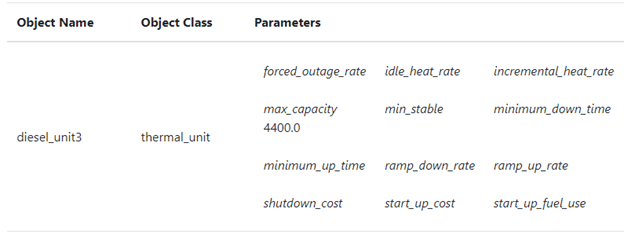

The data is shown in two tables. The first table has a row for each Spine object (e.g. a generator), and all parameters for that object are shown, including parameters with no explicit value. The second table shows Spine relationships (e.g. transmission lines) and the objects they connect.

### Prioritize Hazards
On the Prioritize Hazards page, users drag-and-drop hazards (imported into Spine from the uploaded spreadsheet) onto a risk matrix. This risk matrix assigns a risk-based color coding to each hazard, which is used on the remaining pages to sort the hazards and help the user organize their priorities.

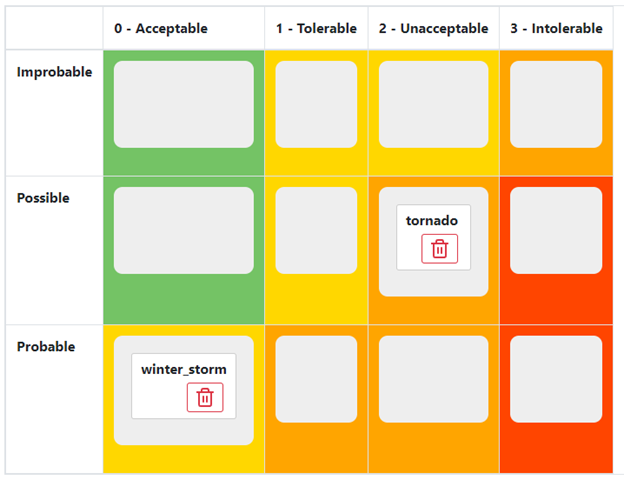

### Define Goals
After prioritizing hazards, the users are directed to the Define Goals page. On this page, they can create quantitative resilience goals for their system. Users are allowed to specify a target value, as well as the desired comparison operator, for each metric calculated by the Spine simulations. Goals can be specified individually for each hazard; for example, a user may want to achieve a very low amount of load not served for a winter storm, but may decide to tolerate a larger amount of load not served in the case of a tornado. The user can also set *base goals*, which are goals that should be met when no hazard is present. The base goal values are used for any hazard-specific goals that are not specified, reducing the number of goals that a user needs to explicitly set.

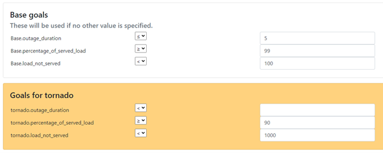

### Run SpineOpt
The Run SpineOpt page is the core of the iterative workflow of the web interface. On this page, users modify their system and run the Spine Toolbox workflow on it. The modified system is saved as the *proposed system* (distinct from the baseline system). The proposed system can be modified in two ways: the user can update the parameter fields for the Spine objects in a web form, or the user can upload a new system spreadsheet. Both methods update the values in Spine. Uploading a new spreadsheet wipes out any changes made via the former method.

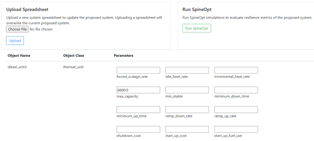

After making modifications to the proposed system, the user can click Run SpineOpt to start the SpineOpt simulations. This runs simulations for each hazard, as described above, and calculates the programmed set of quantitative resilience metrics. When the simulations complete, the user is redirected to the View Results page.

The baseline system and the proposed system are stored as separate SQLite database files in the `.spinetoolbox/items/miracl_db` subdirectory of the project-specific directory. The `miracl_db.sqlite` database is used for the Spine Toolbox workflow, and contains the proposed system. The `baseline.sqlite` file contains the baseline system, which is referenced when e.g. looking at the View Baseline System page.

### View Results
On the View Results page, the user is shown the values of the resilience metrics calculated by the SpineOpt simulations for each hazard, as well as for the base (no hazard) case. An icon is used to visually indicate whether or not each goal was met. The delta (difference between the calculated value and the goal) is also given. From this page, the user can either choose to return to the Run SpineOpt page and further modify their proposed system, or continue on to the Summarize Changes page.

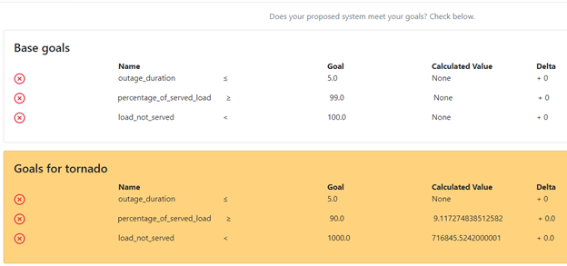

### Summarize Changes
The final page, Summarize Changes, shows the user the difference between their proposed system and their baseline system. This is intended to help the user keep track of the changes they are proposing to implement in order to reach their resilience goals. The summary is shown in three tables: objects that have been added to the system, objects that have been removed from the system, and objects that have been changed (i.e., objects with modified parameters). Clicking Finish on this page returns the user to the project selection page.

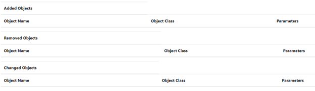

## Troubleshooting
### Spine Toolbox Workflow
Errors in the Spine Toolbox workflow may not be directly visible in the application or console output. To troubleshoot issues with the Spine workflow, try opening Spine Toolbox by invoking the Python module directly:

    python -m spinetoolbox &

This will open the Spine Toolbox window:

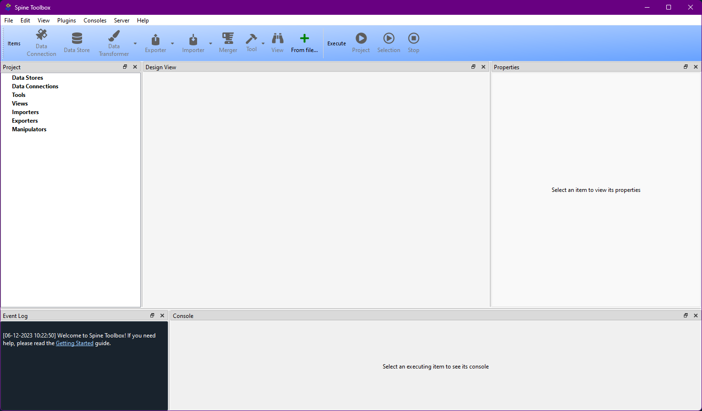

From here, select File->Open project. In the file picker, select `ResDEEDS/spine/projects/<PROJECT>`, where PROJECT is some project that you have created in the ResDEEDS web interface.

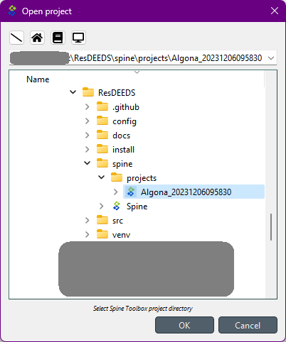

With the project open, you either run the whole workflow and see where it stops, or you can select and run just part of the workflow. For example, if you suspected there was an issue with the `apply_hazards` step, you could select that step and then click the Run Selection button:

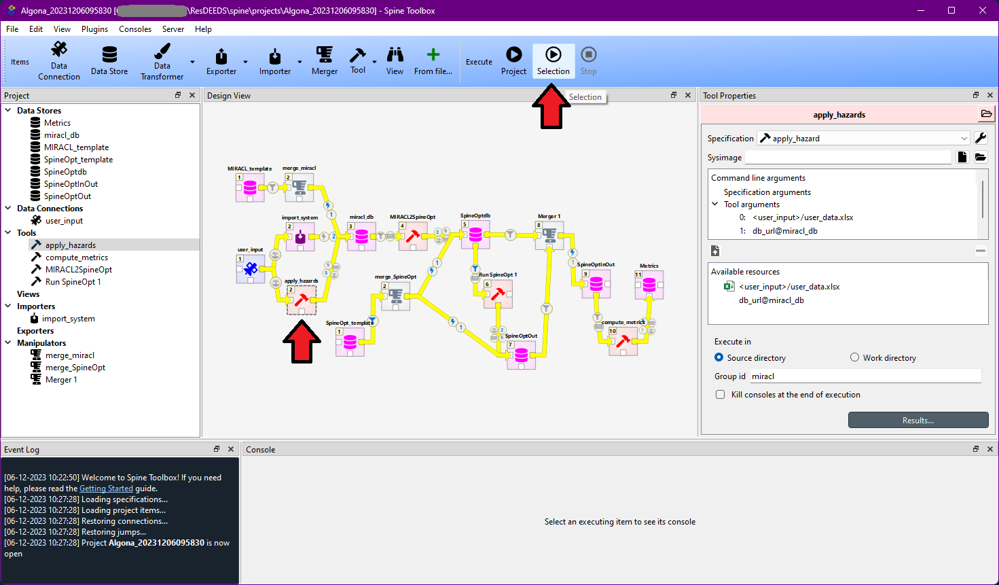

After running all or part of the workflow, you can view the console output of a particular step by selecting it in the GUI. For example, you can see the Julia output of the `apply_hazards` step by selecting it:

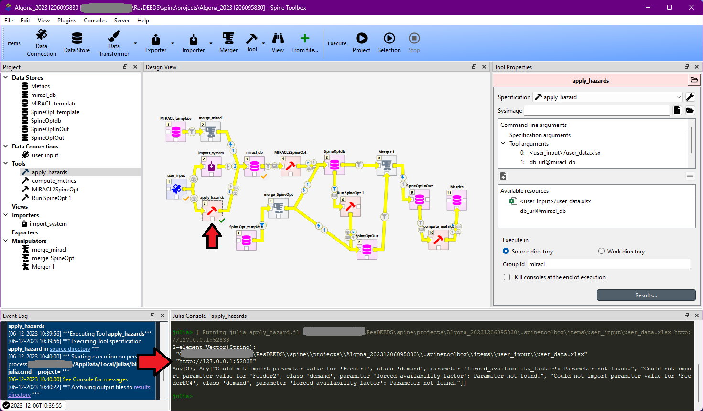

This allows you to debug issues with the Spine Toolbox workflow.