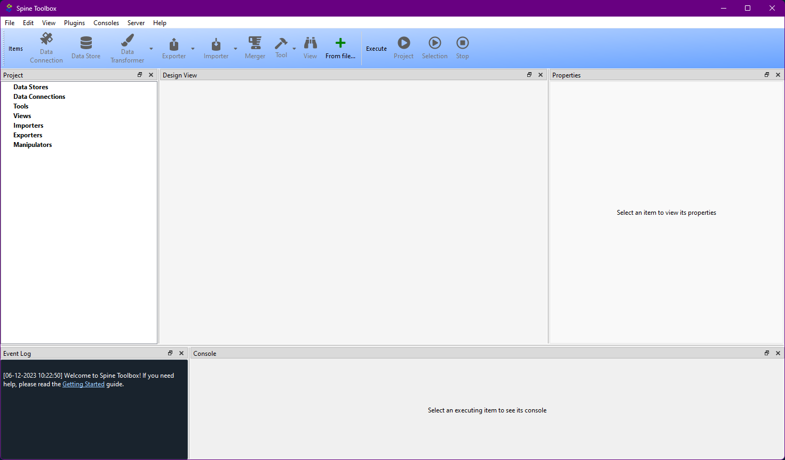
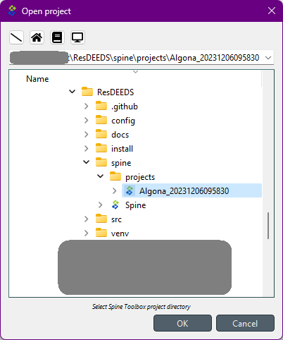
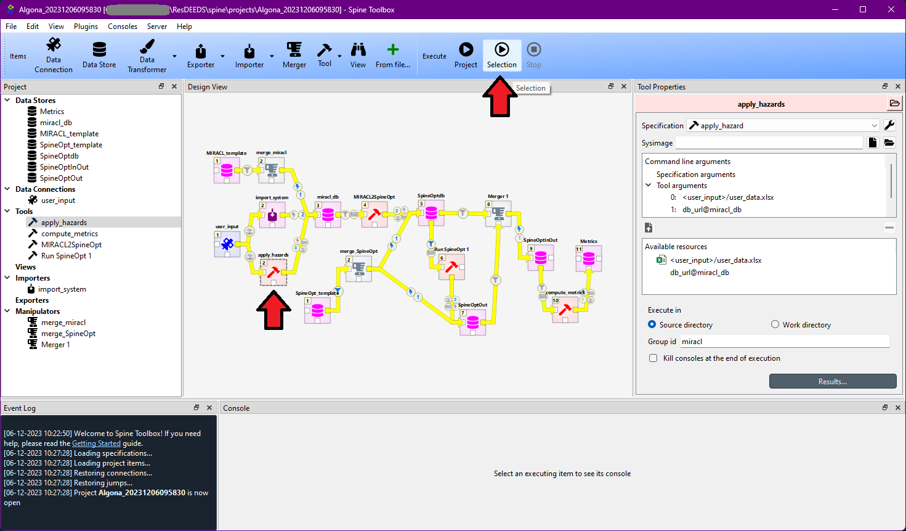
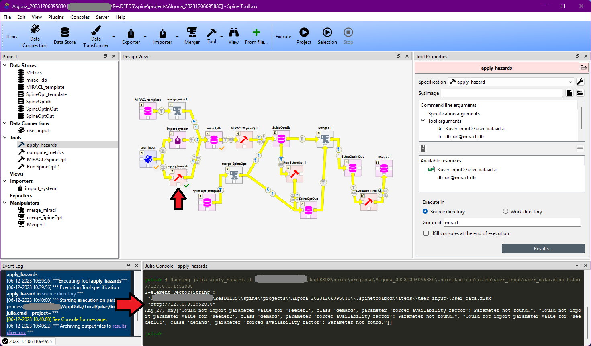

# ResDEEDS User Manual

## Troubleshooting
### Spine Toolbox Workflow
Errors in the Spine Toolbox workflow may not be directly visible in the application or console output. To troubleshoot issues with the Spine workflow, try opening Spine Toolbox by invoking the Python module directly:

    python -m spinetoolbox &

This will open the Spine Toolbox window:

From here, select File->Open project. In the file picker, select `ResDEEDS/spine/projects/<PROJECT>`, where PROJECT is some project that you have created in the ResDEEDS web interface.

With the project open, you either run the whole workflow and see where it stops, or you can select and run just part of the workflow. For example, if you suspected there was an issue with the `apply_hazards` step, you could select that step and then click the Run Selection button:

After running all or part of the workflow, you can view the console output of a particular step by selecting it in the GUI. For example, you can see the Julia output of the `apply_hazards` step by selecting it:

This allows you to debug issues with the Spine Toolbox workflow.